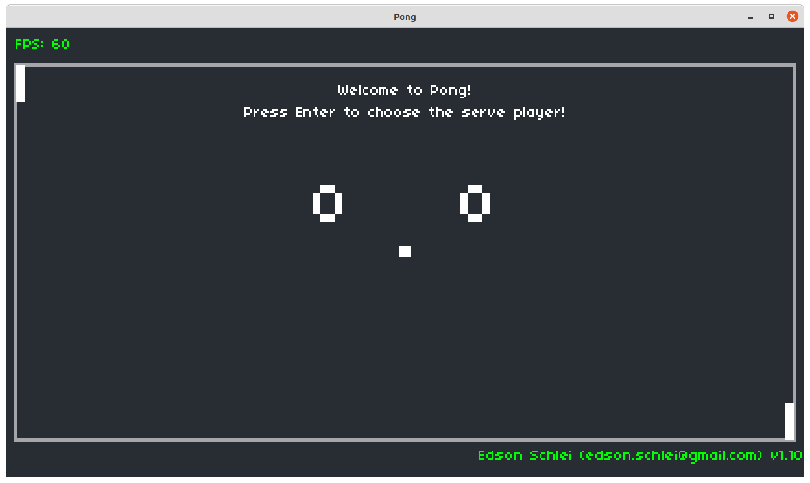

# game-pong

This is my implementation of the 13 steps for the [Pong game](https://cs50.harvard.edu/x/2020/tracks/games/)
activity.

External resources:

Lua
+ [Push.lua](https://github.com/Ulydev/push/blob/master/push.lua)
+ [class.lua](https://github.com/vrld/hump/blob/master/class.lua)

Sounds:
+ [Freesound.org](https://freesound.org/)

Game Image:

